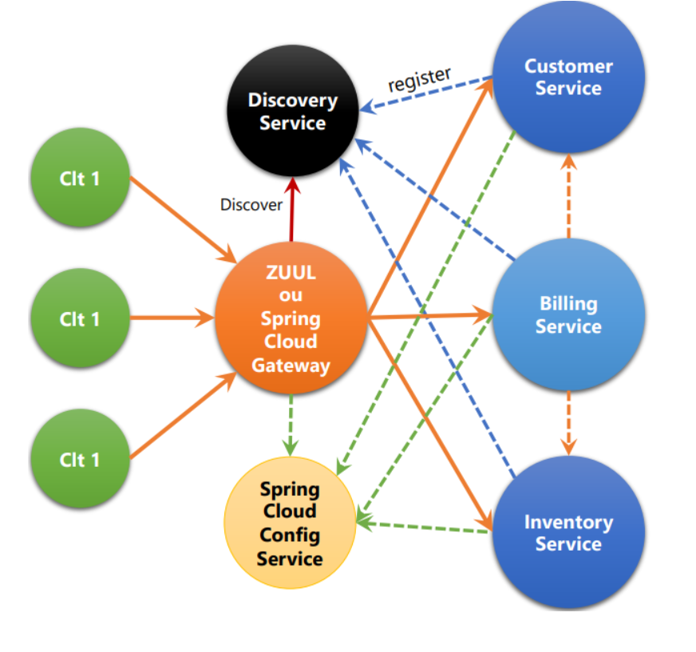
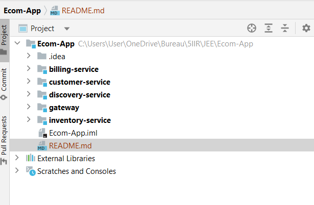
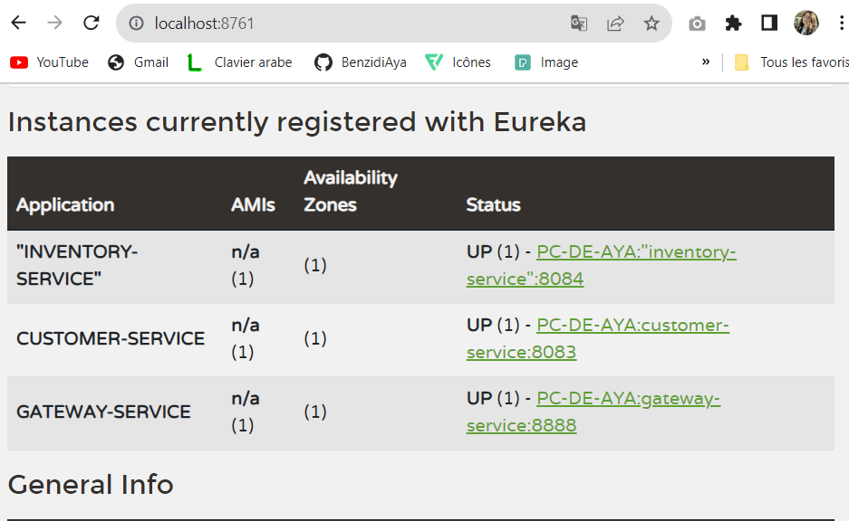
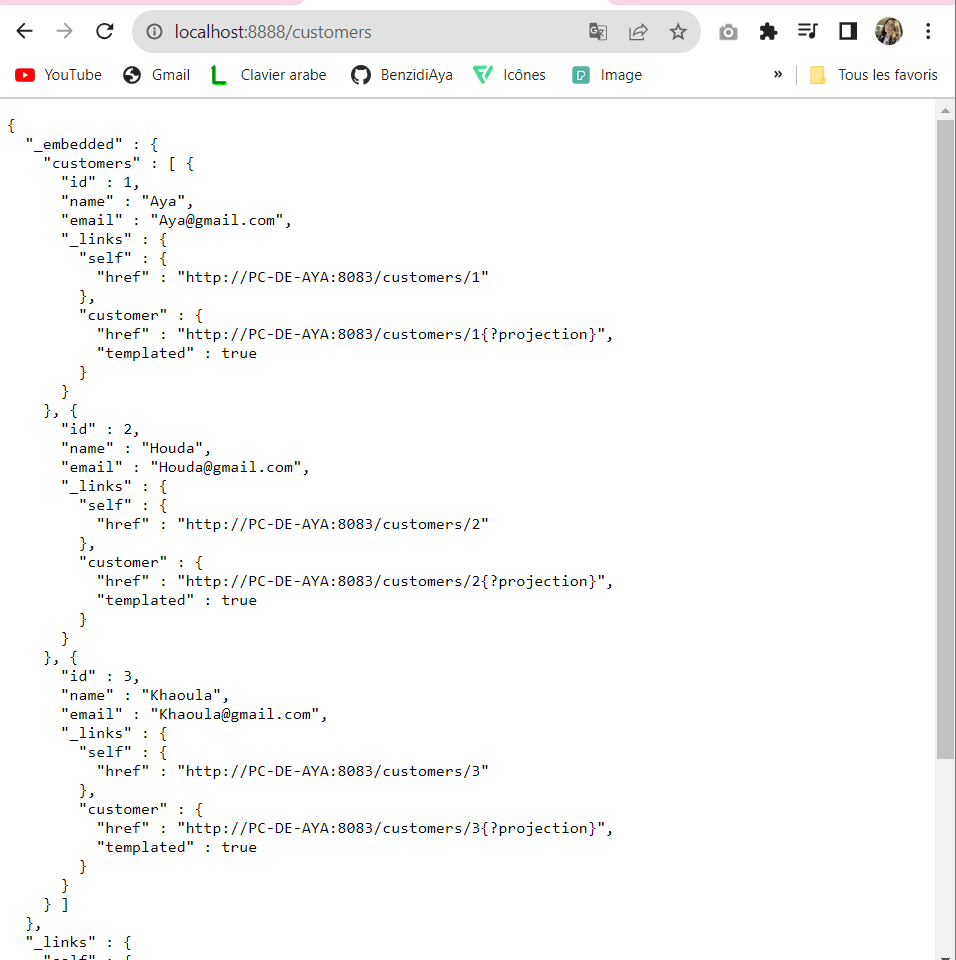
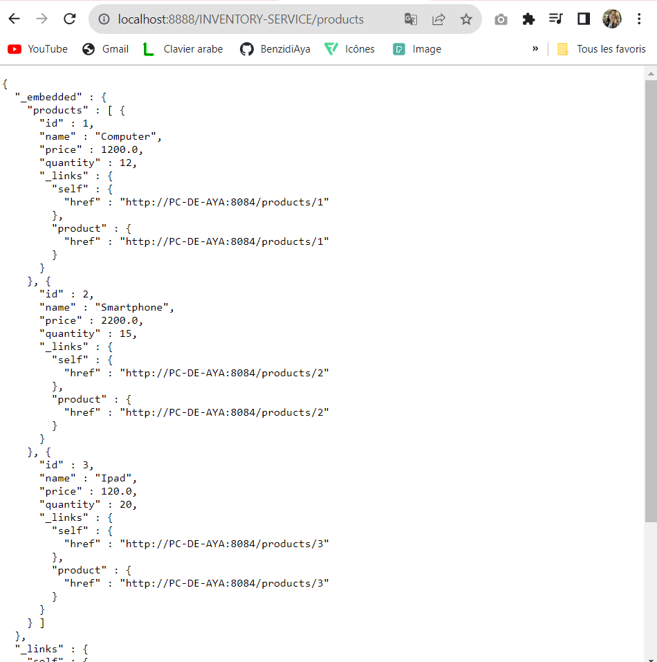
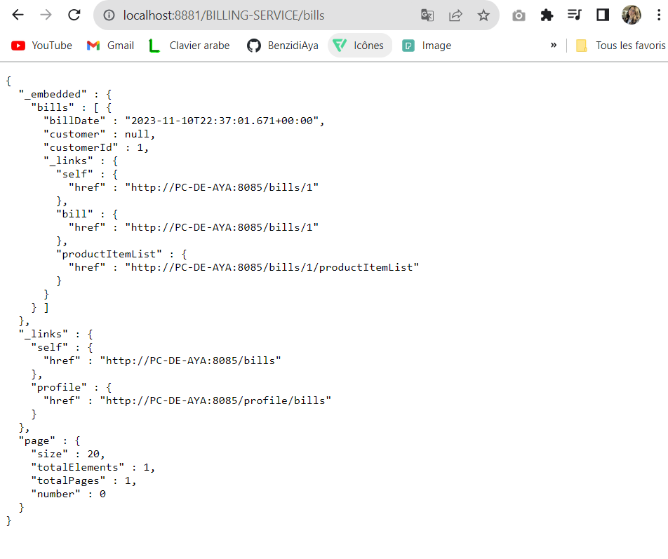

<h1>MicroService Architecture</h1>

Microservice architecture is a design approach where a complex application is decomposed into smaller, independent services that can be developed, deployed, and scaled independently. Each microservice focuses on a specific business capability and communicates with other services through well-defined APIs. This architectural style offers several advantages, including scalability, flexibility, and ease of maintenance. 

<h1>Ecom-App Project</h1>

The project aims to create a scalable, modular, and efficient system for comprehensive business management. Each microservice focuses on specific functionalities, and the use of advanced tools such as Spring Cloud Gateway, Eureka Discovery Service, and OpenFeign ensures a robust and streamlined implementation.

<h5> Here's a breakdown of the project:</h5>

<h4>Customer Microservice (customer-service):<h4>

The creation of a dedicated microservice to manage customer information. This includes functionalities for adding new customers, updating details, and retrieving customer data.

<h4>Inventory Microservice (inventory-service):</h4>

The development of a specialized microservice responsible for handling product inventory. This service allows for effective cataloging, updating, and retrieval of product information.

<h4>Spring Cloud Gateway:</h4>

Implementation of a Spring Cloud Gateway, serving as the central API Gateway. This gateway efficiently manages the routing of requests, directing them to the appropriate microservices based on predefined rules.

<h4>Static Configuration of Routing System:</h4>

Static configuration of the routing system within the Spring Cloud Gateway. This involves defining how requests are directed between the microservices, ensuring optimal flow and performance.

<h4>Eureka Discovery Service:</h4>

Creation of an Eureka Discovery Service to act as a service registry. Eureka enables dynamic registration and discovery of microservices within the system, facilitating seamless communication.

<h4>Dynamic Configuration of Gateway Routes:</h4>

Enhancement of the Spring Cloud Gateway to support dynamic route configuration. This enables adaptability to changes in the system and allows for efficient routing adjustments without the need for manual intervention.

<h4>Billing Management Microservice (billing-service) using OpenFeign:</h4>

Development of a specialized billing management microservice integrated with OpenFeign. OpenFeign simplifies communication between microservices, providing a declarative approach for defining HTTP clients.

<h4>Discovery Service : Spring Cloud Eureka Server </h4>

<h4>Customer Service </h4>

<h4>Inventory Service </h4>

<h4>Billing Service </h4>
